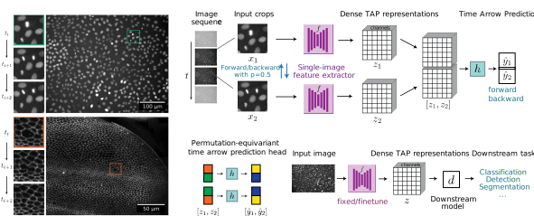

# Time arrow prediction (TAP) for live-cell microscopy

This repository contains the code for the TAP method described in
> Benjamin Gallusser, Max Stieber and Martin Weigert<br>[*Self-supervised dense representation learning for live-cell microscopy with time arrow prediction*](https://arxiv.org)<br>arXiv, 2023

TAP is a self-supervised pre-training method based on time arrow prediction that learns dense image representations from raw, unlabeled live-cell microscopy videos. The pre-training task consists of predicting the correct order of time-flipped image regions via a *single-image feature extractor* and a subsequent *time arrow prediction head* (as shown in the figure above).





The resulting dense representations capture inherently time-asymmetric biological processes such as cell divisions on a pixel-level, as indicated by the model's attribution maps (Grad-CAMs) show in the video below.

https://github.com/weigertlab/tarrow/assets/8866751/7978d672-b024-4673-b092-0c35ce74df5d

Importantly, the representations from TAP pre-training are beneficial for training machine learning models that solve downstream image analysis tasks, such as detection and segmentation of dividing cells or cell state classification, particularly when only limited ground truth annotations are available as is commonly the case in practice.


## Installation

We provide TAP training and inference methods as the python package `tarrow`, which can be installed as follows:

- Install [`mamba`](https://mamba.readthedocs.io/en/latest/installation.html) (or `conda`, the same but slower) and create a fresh environment: `mamba create --name tarrow`.
- Activate the environment: `mamba activate tarrow`.
- Pip install the `tarrow` python package directly from this GitHub repository:
```
pip install git+https://github.com/weigertlab/tarrow.git
```

## Data
Run
```
python scripts/download_data.py
```
to obtain the public datasets HELA and MDCK, as listed in the [publication](https://arxiv.org).


## Usage
### Training a TAP model (no ground truth needed!)

> Note: The default configurations assume that your machine has a Nvidia GPU with at least 24GB of memory.

The main script for self-supervised training is called `scripts/train.py`

The only thing you need is a live-cell microscopy video (2D+time).

The training can be invoked with
```
python train.py -c config.yaml
```

where `config.yaml` defines the input arguments ([example config](scripts/configs/hela.yaml)).

The input arguments can also be passed in via command line, and overwrite the values from the `config.yaml` file, e.g.

* `--input_train` either folders containing a temporally ordered sequence of 2D images, or a individual 2D+time tif images.
* `--delta` timestep(s) between frames
* `--split_train` interval of video (relative) to use for training, e.g. `--split_train 0.0 0.8`
* `--split_val` interval of video (relative) to use for validation, e.g. `--split_train 0.8 1.0`.

```
python train.py --input_train my_video.tif --delta 1 2 --split_train 0.0 0.8 --split_train 0.8 1.0
```
### Monitor the training
To monitor the progress of TAP pretraining, run (in the base directory of this repo)
```
tensorboard --logdir scripts/runs
```
You can check out:
- The training and validation loss, as well as time arrow prediction accuracy
- Example input image patches, both from training and validation set
- The evolution of TAP attribution maps during training on a few example frames of the video, including insets of the most highlighted regions, as shown below.


### Using a trained TAP model

Load a trained TAP model to obtain dense representations:
```python
import tarrow

model = tarrow.models.TimeArrowNet.from_folder(model_folder="hela_backbone_unet")

# Dummy data: Batch, Time, Channel, X, Y
x = torch.rand(1, 2, 1, 96, 96)

# Dense dummy representations
rep = model.embedding(x)
print(f"Dense representations for image `x` with shape {tuple(rep.shape)}")
```
